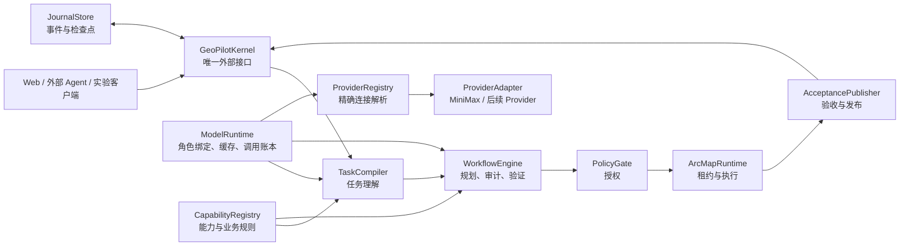

# GeoPilot 目标架构与一次性重构规范

> 状态：实施基线  
> 适用仓库：`D:\Development\Python\Arcpy`  
> 目标：将 GeoPilot 从以对话和模型调用为中心的 ArcMap 助手，重构为可恢复、可审计、权限受控、结果可验证的业务化 AI GIS。  
> 本文描述唯一目标架构。重构不保留旧合同、旧数据库、旧路由或旧执行链路的兼容层。

## 1. 结论

GeoPilot 不应演变成可以自由调用工具、互相传递长对话并直接操作 GIS 的多 Agent 群。最终系统采用：

**确定性 GIS 内核 + 受约束 AI 决策层 + 持久化运行状态机 + 独立成果验收。**

AI 只负责理解用户意图、提出计划和发现计划缺陷；上下文绑定、能力选择、权限、计划验证、ArcMap 目标绑定、执行、成果验收和发布均由确定性代码负责。不能证明安全或正确时，系统必须停止并返回明确状态，不能猜测、兜底、切换模型或静默重试。

从成熟 Agent 产品借鉴以下模式：

- ZCode Goal Mode：任务是持久运行对象，拥有状态、预算、恢复点和独立验证，而不是一段越来越长的提示词。
- ZCode/OpenClaw：角色隔离、工具最小授权、显式路由；不借鉴自由 Agent 直接产生副作用。
- VS Code/Copilot：稳定提示词前缀、延迟加载工具合同、隔离子任务上下文，提高供应商前缀缓存命中。
- Temporal/LangGraph：持久状态机、幂等活动、检查点、明确处理中断；本地 ArcMap 桌面产品不引入 Temporal 服务，但引入 LangGraph 框架（§13.2）实现 WorkflowEngine 的规划状态机、检查点和中断恢复，由 JournalStore SQLite 事务日志作为事实源。
- Pydantic v2：声明式合同验证和 JSON Schema 同源生成（§13.1），替代手写 dataclass 校验和手写 schema。
- NIST AI RMF：风险、权限、测量、审计和人工决策必须成为产品结构，不是发布前补充文档。

参考资料：

- <https://zcode.z.ai/en/docs/goal>
- <https://zcode.z.ai/en/docs/subagents>
- <https://docs.openclaw.ai/concepts/multi-agent>
- <https://code.visualstudio.com/blogs/2026/06/17/improving-token-efficiency-in-github-copilot>
- <https://docs.temporal.io/workflow-execution>
- <https://langchain-ai.github.io/langgraph/>
- <https://docs.pydantic.dev/latest/>
- <https://www.nist.gov/itl/ai-risk-management-framework>

## 2. 不可破坏的架构不变量

以下规则必须由代码和测试保证：

1. 未通过确定性验证的计划不能执行。
2. 未绑定准确 ArcMap 租约、窗口、上下文和计划哈希的请求不能执行。
3. Agent、规划器、执行器都不能给自己授权。
4. 未通过独立验收的成果不能发布到用户正式位置。
5. 执行是否发生无法确定时，禁止自动重放，状态必须是 `ExecutionIndeterminate`。
6. 已持久化成功的相同模型调用可以零调用复用；不确定、失败、额度错误的模型调用不能缓存。
7. 当前角色绑定的模型额度不足时立即进入 `QuotaStopped`，不重试、不切换供应商。
8. 新任务拥有全新对话上下文；历史任务不得自动进入模型输入。
9. 模型不能创建并启用生产代码。自建工具只能通过独立管理员流程审核、测试、签名和部署。
10. 所有正式成果都能追溯到用户请求、上下文、能力版本、业务规则、模型调用、计划、授权、执行回执和验收报告。

“绝对零故障”不能被软件工程证明；本架构保证的是：不能证明正确就不执行，不能证明成功就不发布，发生不确定状态就停止并完整留证。

## 3. 系统总览



`GeoPilotKernel` 是唯一对调用者公开的深模块。调用者只需要理解四个操作：

```python
submit(request_envelope) -> RunView
inspect(run_id) -> RunView
decide(run_id, approval_decision) -> RunView
resume(run_id) -> RunView
```

HTTP、Web UI、外部 Agent 和实验程序只是这个接口的 Adapter，不得直接调用模型、ArcMap Bridge、规划器或数据库业务方法。

## 4. 核心合同

所有跨模块结果使用严格的可辨识联合类型。异常可以在模块内部使用，但不能作为跨模块业务协议。

### 4.1 RequestEnvelope

包含：

- `session_id`
- `request_id`
- 用户原始文本
- 调用者身份、机构、角色和数据权限范围
- 是否请求执行
- 用户明确授权的副作用范围
- 用户明确指定的输入、输出和路径
- 当前客户端身份

禁止调用者提交可由服务器推导的字段。

### 4.2 ContextSnapshot

规划前由指定 ArcMap 租约捕获并冻结，至少包含：

- ArcMap、Bridge、窗口和地图文档身份
- 图层稳定引用、名称、数据源和图层类型
- 字段结构、坐标系、选择状态和必要的值摘要
- 地图视图、活动数据框、编辑会话状态
- 捕获时间、部署哈希、完整内容哈希

模型只看到任务相关的 `ContextProjection`；完整快照保留为证据。Projection 必须能够追溯到快照及选择规则。

#### 增量捕获

上下文捕获分两层，禁止无条件全量采样：

- **结构层**（图层引用、字段名、坐标系、几何类型、选择计数）：每次捕获全量。这一层是纯 COM Describe，开销在百毫秒级，不阻塞 ArcMap UI。
- **值摘要层**（每个字段的值样本）：惰性捕获。只有在 TaskCompiler 判定需要值样本时（例如属性过滤条件、字段值匹配）才按需采样，不得对每个 feature layer 无差别开 SearchCursor 扫描。

执行后的上下文复核（after_execution）只捕获 workflow 声明的输出图层，不重扫全图。上下文哈希变化时拒绝旧计划，但复核范围受限于声明输出，不做全量重捕获。

`ContextSnapshot` 的 `content_hash` 只覆盖结构层；值摘要作为 `ContextProjection` 的可选部分单独哈希，避免值样本变化导致不必要的计划失效。

### 4.3 IntentSpec

只表达用户业务目标，不表达模型猜测的实现细节：

- 已绑定的输入实体
- 业务目标和空间语义
- 约束、过滤、分组和选择要求
- 预期成果及质量条件
- 用户声明的路径、字段和值
- 可接受副作用
- 每项解释对应的上下文或用户证据

输出格式、图层类型、选择派生、默认工作区等确定事实由服务器绑定。

### 4.4 CapabilitySnapshot

从权威能力目录冻结，包含本任务实际允许的操作卡、业务规则和版本哈希。模型不得使用快照外的操作。

### 4.5 VerifiedPlan

包含：

- `IntentSpec` 哈希
- `ContextSnapshot` 哈希
- `CapabilitySnapshot` 哈希
- 有序工作流
- 确定性验证报告
- 审计意见和修订历史
- 模型身份与提示词版本
- 风险和权限需求
- 最终计划哈希

封存后不可修改。任何变化都产生新的计划版本和哈希。

### 4.6 AuthorizationGrant

授权必须绑定：

- 用户、机构、角色和数据范围
- `session_id`、`run_id`、计划哈希
- 输入和输出身份
- 允许的副作用等级
- RuntimeLease 身份
- 过期时间、nonce 和授权版本

路由选择不等于授权，Agent 请求也不等于授权。

### 4.7 RuntimeLease

包含：

- `lease_id`
- `gateway_pid`
- `arcmap_pid`
- `bridge_pid`
- `bridge_port`
- `target_hwnd`
- `deployment_hash`
- `epoch`
- `acquired_at`、`last_heartbeat`

所有上下文捕获、执行请求、心跳和回调必须携带 `lease_id + epoch + plan_hash`。

### 4.8 统一 Outcome

终态和暂停态必须明确区分：

```text
Succeeded
ClarificationRequired
PolicyDenied
ContractFailed
CapabilityFailed
InfrastructureFailed
QuotaStopped
ModelCallUncertain
ExecutionIndeterminate
AcceptanceFailed
Cancelled
```

每个 Outcome 至少包含 `kind`、`code`、`stage`、用户可读消息、操作员动作、证据引用和是否可恢复。禁止使用含义模糊的 `completed`。

## 5. TaskSession：新任务零对话污染

任务会话是服务器对象，不是浏览器中的聊天数组。

### 5.1 新任务行为

点击“新任务”时：

1. 服务端创建新的 `session_id`。
2. 对话、摘要、工具结果、修复记录、Agent 临时状态全部为空。
3. 捕获新的当前 ArcMap ContextSnapshot。
4. 模型输入只能读取当前 `session_id` 的记录。
5. 历史会话保留在审计库中，但不进入新会话的检索、摘要或提示词。

只有用户显式执行“引用历史任务成果”，才能将指定的 `ArtifactManifest` 导入当前任务，并记录来源、哈希和导入人。

### 5.2 新任务与新工作区

- “新任务”：清空对话和 Agent 状态，保留当前真实 ArcMap 地图状态。
- “新工作区”：是独立、显式、有权限检查的操作，用于创建或恢复干净地图环境。

不得因为用户新建任务而静默撤销地图编辑或删除成果。

### 5.3 缓存与会话隔离

纯模型结果允许跨会话精确复用，但缓存键必须包含机构和安全范围，且响应中不得含 run_id、session_id、临时路径或其他会话身份。复用后生成新的运行绑定和证据记录。

缓存不等于记忆。缓存只回答“完全相同、已经验证的纯计算是否需要再次支付模型调用”；它不能向新会话注入旧消息。

## 6. 深模块设计

### 6.1 GeoPilotKernel

职责：

- 接收请求并创建 Run
- 驱动状态机
- 写入事务事件和检查点
- 调用 TaskCompiler、WorkflowEngine、PolicyGate、ArcMapRuntime、AcceptancePublisher
- 处理取消、审批、恢复和并发
- 返回统一 RunView

它不理解具体 GIS 操作，不拼模型 Prompt，不扫描 ArcMap 端口，不直接发布文件。

### Run 状态机

```text
received
→ context_frozen
→ intent_compiled
→ plan_verified
→ authorization_required / authorized
→ runtime_acquired
→ executing
→ executed
→ accepted
→ published
→ succeeded
```

任意阶段可进入对应的明确 Outcome。状态转换和事件写入必须在同一 SQLite 事务中完成。

### 6.2 TaskCompiler

接口：

```python
compile(request, context_snapshot, capability_index, domain_rules) -> IntentOutcome
```

输出只能是：

- `IntentCompiled(IntentSpec)`
- `ClarificationRequired`
- `ContractFailed`

实现顺序：

1. 确定性提取明确路径、字段、数值和授权。
2. 生成面向模型的最小 ContextProjection。
3. 模型提交意图草案。
4. 服务端绑定实体并派生确定事实。
5. 严格合同验证和证据验证。
6. 只有影响结果唯一性或安全性的缺失信息才转为追问。

### 6.3 WorkflowEngine

接口：

```python
plan(intent_spec, context_snapshot, capability_snapshot, planning_mode) -> PlanningOutcome
```

内部状态机使用 LangGraph `StateGraph` 实现（§13.2）：

```text
生成草案
-> 确定性验证
-> 最多限定次数的合同修复
-> G3 审计
-> 必要时修订语义或计划
-> 最终确定性验证
-> 封存 VerifiedPlan
```

每个节点是一个纯函数，接收 `RunState` 返回部分更新。检查点由 LangGraph `SqliteSaver` 持久化到 JournalStore SQLite；`thread_id = run_id`。`authorization_required` 暂停用 `interrupt_before` 实现。节点级事件通过 `stream_mode="updates"` 推送到 SSE（§14）。修复循环上限由 `recursion_limit` 控制。

G3 审计只能指出具体、非重复、可验证的问题；不能改写用户目标、增加未要求成果、放宽验证或直接宣布正确。最终裁决永远由确定性验证器作出。

生产 G3 中，TaskCompiler 结果必须复用；审计计划时不得无条件重新进行完整语义编译。实验比较时，G3 必须建立在同一封存基线和同一上下文上，只增加审计变量。

### 6.4 ModelRuntime 与 Provider 边界

接口：

```python
invoke(model_request, output_contract) -> ModelResult
```

调用链固定为：

```text
Agent / Workflow
  -> ModelRuntime
  -> ProviderRegistry
  -> ProviderAdapter
```

Kernel、TaskCompiler、WorkflowEngine 和 Agent 只依赖 `ModelRuntime`，不导入任何供应商客户端。Provider 网络协议、错误转换和流式响应解析全部封装在 Adapter 内。

`ModelRuntime` 唯一拥有：

- `AgentModelPlan` 的角色绑定解析
- `ProviderRegistry` 的精确连接查找
- Prompt 的确定性渲染和版本管理
- 本地精确结果缓存
- 模型调用 reserve/call/validate/commit 状态
- `TokenPlan` 预算、并发、速率和费用限制
- Token、延迟、费用和缓存指标
- 结构化响应验证（Pydantic `model_validate`，§13.1）
- 流式输出（§14）：支持流式的 Adapter 启用 `stream=True`，逐 token 推送 `model.token` 事件；不支持流式的 Adapter 静默跳过，不阻塞

当前安装 MiniMax Adapter，离线测试安装 Fake Adapter。这不是架构白名单；新增 DeepSeek API、Ollama、本地 vLLM 或 OpenAI-compatible 时，必须新增 Adapter 与显式连接，不修改 Kernel 和 Workflow。任何连接不可用都明确失败，不得自动选模、自动换连接或 fallback。

#### Provider 与角色合同

- `ProviderConnection`：`connection_id`、`provider_type`、`endpoint`、`credential_ref`、`enabled_models`、`deployment_fingerprint`。
- `ModelBinding`：`connection_id`、`model_id`、`role`、`temperature`、`max_output_tokens`、`budget_policy`。
- `AgentModelPlan`：分别绑定 `compiler`、`planner`、`auditor`、`repairer`，可使用不同 Provider 和模型。
- `TokenPlan`：调用预算、上下文上限、输出上限、并发限制、请求/令牌速率和费用上限。

凭据由 DPAPI 凭据库保存。连接、计划、任务和调用证据只保存 `credential_ref`，不保存明文密钥。每次调用记录实际 provider、model、connection、endpoint fingerprint、deployment fingerprint、role、采样参数、TokenPlan 和 credential_ref。

第三章正式实验另有 `ExperimentSpec` 和 `ExperimentSupervisor` 锁：`provider=minimax`、`model=MiniMax-M3`。实验锁不进入普通任务的 `AgentModelPlan`。

### 精确缓存键

```text
SHA256(
  tenant_id
  + security_scope_hash
  + provider
  + model
  + connection_id
  + endpoint_fingerprint
  + deployment_fingerprint
  + role
  + prompt_version
  + system_prompt_hash
  + input_hash
  + tool_contract_hash
  + capability_hash
  + context_projection_hash
  + domain_rule_hash
  + generation_parameter_hash
  + model_binding_hash
  + token_plan_hash
)
```

只复用 `succeeded + schema_validated` 的记录。禁止缓存：

- 额度错误
- 网络和协议错误
- 合同验证失败
- 未知是否已经返回的调用
- 包含会话身份或临时输出路径的响应

### 调用账本

```text
reserved → calling → succeeded
                   → failed
                   → quota_stopped
                   → uncertain
```

相同 `call_key` 在并发时只能有一个调用者访问供应商。进程崩溃后，`succeeded` 直接复用；`uncertain` 不得自动重试。

### Prompt 布局

```text
稳定平台合同
→ 稳定角色指令
→ 稳定能力索引或工具合同
→ 版本化领域规则
→ 动态 ContextProjection
→ 动态用户请求
→ 本轮诊断和修复信息
```

稳定前缀中禁止放入时间戳、run_id、session_id、随机路径或无序 JSON。JSON 必须使用规范序列化和稳定排序。

### 6.5 CapabilityRegistry

每个 CapabilitySpec 至少声明：

- 稳定 operation id
- 面向用户的业务语义
- 参数和输出合同
- 输入/输出数据种类
- 坐标系、单位、几何和选择要求
- 前置条件、后置条件和语义效果
- 副作用等级
- 是否可幂等重放
- 所需 ArcGIS 扩展和运行版本
- 验收器规则
- 实现和测试的部署哈希

模型先读取精简稳定索引，TaskCompiler 完成后由服务器计算闭包，只把必要的完整能力卡交给 WorkflowEngine。

能力覆盖通过受审查的 Capability Pack 扩展。运行时自建代码从生产链路删除；管理员工具输出的包必须离线通过合同、Python 2.7、ArcPy 限权、数据写入、故障注入和成果验收测试，签名部署后整体加载。

### 6.6 PolicyGate

接口：

```python
authorize(actor, verified_plan, runtime_lease, requested_effects) -> AuthorizationOutcome
```

风险分级：

1. 只读查询。
2. 可恢复地图会话变化，例如选择、可见性和视图。
3. 隔离工作区数据写入。
4. 破坏性编辑或覆盖发布。

第 4 类默认禁用；只有底层能够提供事务回滚、明确对象身份和显式授权时才能开放。无法保证原子性的操作必须拒绝，而不是提示后继续。

### 6.7 ArcMapRuntime

接口：

```python
acquire(target_selector, deployment_hash) -> LeaseOutcome
capture(lease) -> ContextOutcome
execute(lease, verified_plan, authorization_grant) -> RuntimeOutcome
reconcile(lease, run_id) -> ReconciliationOutcome
```

它唯一负责：

- 精确绑定 ArcMap、Bridge、端口和 HWND
- 部署哈希校验
- 单写者租约、心跳和 fencing
- 执行前上下文复核
- outbox、执行回执和重复回调拒绝
- staging 输出
- 自己拥有的进程清理

禁止扫描并选择“第一个健康端口”，禁止 Bridge 死亡后静默切换另一个实例。用户已连接窗口和实验启动窗口必须有不同、明确的 TargetSelector。

ArcMap Python 2.7 端只保留确定性执行、上下文观测、事务/恢复能力和回执协议，不包含模型、业务语义解释或权限决策。

### 6.8 AcceptancePublisher

接口：

```python
accept(intent_spec, verified_plan, runtime_outcome) -> AcceptanceOutcome
publish(staged_artifacts, acceptance_report, authorization_grant) -> PublicationOutcome
```

验收器独立检查：

- 成果存在性和精确身份
- 类型、字段、记录数和输出数量
- 坐标系、单位、几何类型和几何有效性
- 选择状态和地图状态
- 工作流声明的空间、属性和业务后置条件
- 未声明副作用
- 文件或数据集哈希

写数据操作优先使用 copy-on-write staging。验收通过后再执行原子发布；无法原子发布的能力必须在 CapabilitySpec 中明确禁止覆盖或提供可证明的事务实现。

## 7. 持久化与恢复

使用新的 SQLite 数据库和 WAL。旧数据库不迁移，启动时发现旧表或旧合同直接拒绝。旧数据库如需审计，由人工移到归档目录，不参与运行。

建议表：

```text
sessions
runs
run_events
planning_context_snapshots / captured_context_snapshots
capability_snapshots
intent_specs
verified_plans
model_calls
runtime_leases
authorization_grants
execution_receipts
artifacts
acceptance_reports
publication_receipts
```

`run_events` 为追加写事实源，`runs` 是事务内更新的状态投影。UI 事件从 Journal 投影生成，EventBus 不是事实源。

恢复规则：

- 已提交 IntentSpec、VerifiedPlan、模型响应和验收报告直接复用。
- 规划前或纯计算阶段可从最后检查点继续。
- 已发出执行请求但没有权威回执时先 reconcile；无法证明未执行则进入 `ExecutionIndeterminate`。
- 额度停止不自动重试。
- ContextSnapshot、CapabilitySnapshot、部署哈希或业务规则发生变化时，旧计划不能直接执行。

## 8. 安全与政务部署

1. 删除 `Access-Control-Allow-Origin: *`，只允许固定本地来源或部署白名单。
2. 所有写请求要求会话令牌和 CSRF 防护；网络部署必须接入机构身份认证和 RBAC。
3. API 密钥不得写入普通 JSON；Windows 部署使用受控凭据存储或 DPAPI。
4. 模型出站内容按数据分类策略生成白名单 Projection；默认不发送完整属性样本、路径凭据和敏感字段值。
5. Prompt、响应和缓存内容按机构隔离并加密保存；哈希可用于索引，但不能替代访问控制。
6. 审计日志追加写，并定期生成哈希链摘要；普通 UI 无删除审计记录权限。
7. 生产运行时禁止动态加载未经签名的 executor。
8. 日志、错误和遥测必须脱敏，不记录 API key、授权令牌和完整敏感数据。

## 9. 文件重构目标

目标目录按深模块组织，不为每个小函数创建浅模块：

```text
gateway_py3/
  api/
    http_adapter.py
    contracts.py
  kernel/
    coordinator.py
    contracts.py
    store.py
    state_schema.py
  intelligence/
    task_compiler.py
    workflow_engine.py
    structured_outputs.py
  model_runtime/
    contracts.py
    adapter.py
    registry.py
    runtime.py
    credentials.py
    configuration.py
    adapters/
      minimax.py
  capabilities/
    registry.py
    validation.py
    knowledge.py
  runtime/
    arcmap_runtime.py
    context_capture.py
    acceptance_publisher.py
    policy.py
  streaming/
    event_projection.py
    sse_channel.py
  web/

arcmap_runtime_py2/
  protocol/
  operations/
  runtime.py

admin_tooling/
  capability_builder/

experiments/
  supervisor/
```

如果一个目标文件只做参数转发，应合并回所属深模块，不保留浅层包装。

### 现有文件处置

| 现有文件或链路 | 目标处置 |
|---|---|
| `planning_engine.py`、`planning_state_machine.py` | 逻辑收进 WorkflowEngine，迁移完成后删除 |
| `task_contract.py`、`semantic_domain.py` | 逻辑收进 TaskCompiler，迁移完成后删除 |
| `minimax_client.py` | 删除旧路径；MiniMax 网络细节进入 `model_runtime/adapters/minimax.py` |
| `run_controller.py`、`gateway_state.py` | 由 GeoPilotKernel 替换，迁移完成后删除 |
| `run_store.py`、`run_store_schema.py` | 新 JournalStore/SQLite Adapter 替换；旧数据库不兼容 |
| `routes/*` | 变成只调用 GeoPilotKernel 的 HTTP Adapter |
| `arcmap_bridge_client.py` 的端口扫描/静默拉起 | 删除，由 ArcMapRuntimeLease 替换 |
| `agent_tools.py` 的 ToolBuilder 工具 | 从生产模型工具集中删除 |
| `tool_builder*.py` | 移到独立管理员工具，不被生产网关导入 |
| `event_bus.py` | 只推送 Journal 投影，不决定状态 |
| `voice.py` 中第二规划模型链路 | 删除；语音仅产生未经信任的原始用户文本 |
| `run_ablation_campaign.py`、`run_formal_experiments.py` | 生产链路稳定后由 ExperimentSupervisor 替换并删除 |
| `context_reader.py`（Py2）的值样本全量扫描 | 替换为增量捕获（§4.2），结构层全量、值摘要惰性 |
| `web/app.js` 的 `waitForRun` 退避轮询 | 删除，SSE 事件驱动 UI 更新（§14） |
| `web/app.js` 的假计时器 `modelWaitTimer` | 删除，改为真实阶段展示（§14.4） |
| `event_bus.py` 的内存 200 条历史 | 替换为从 `run_events` 事实表投影（§14.3） |

保留并深化：

- `operation_catalog` 中成熟的操作实现和合同信息
- 确定性 workflow/语义验证规则
- PlanArtifact、ExecutionContract 的哈希绑定思想
- `run_store.py` 已有的执行 claim、heartbeat、fencing、`recovery_required`、`indeterminate` 思想
- ArcMap Python 2.7 的 operation 实现、execution outbox 和权威运行观测

这些概念保留，但旧公开类型、旧导入路径和旧并行链路不保留。

## 10. 实施阶段

每阶段先贯通一个最小端到端切片，再扩大覆盖；同一能力迁移完成后立即删除对应旧链路，不长期双轨。

### 阶段 A：合同与新内核

- 建立核心合同、Outcome、Session、Run 状态机和新数据库。
- 实现 GeoPilotKernel 四个公开操作。
- 用 Fake Model 和 Fake ArcMap Adapter 跑通一个只读操作。
- 实现"新任务"服务端隔离。
- 合同先用 frozen dataclass 实现，阶段 B 迁移到 Pydantic v2 `BaseModel`。

### 阶段 B：ModelRuntime、缓存与 Pydantic 迁移

- 引入 Pydantic v2 依赖，锁定版本，确认 Windows + Python 3.11 兼容。
- 核心合同（§4）从 frozen dataclass 迁移到 Pydantic v2 `BaseModel`，`frozen=True` + `extra='forbid'` + `validate_assignment=True`。
- 模型输出验证用 `model_validate` 替代手写校验；`tools` JSON Schema 用 `model_json_schema()` 自动生成。
- `digest()` 规范哈希输入改用 `model_dump(mode='json')`。
- 实现规范 Prompt、调用账本、single-flight 和精确结果缓存。
- 建立严格 ProviderConnection、ModelBinding、AgentModelPlan、TokenPlan、ProviderRegistry 和 ProviderAdapter 合同。
- 当前只安装 MiniMax Adapter 与离线 Fake Adapter；删除规划链路中的直接 provider 调用、自动选模和 fallback。
- ModelRuntime 的 `invoke()` 支持流式输出接口（§14），支持流式的 Adapter 启用 `stream=True`。

### 阶段 C：TaskCompiler 与 WorkflowEngine（LangGraph）

- 引入 LangGraph 依赖，锁定版本，确认 Windows + Python 3.11 兼容。
- WorkflowEngine 规划状态机用 LangGraph `StateGraph` 实现（§13.2）：草案、确定性验证、有界修复、G3 审计、必要修订、最终验证、封存声明为图节点和条件边。
- LangGraph `SqliteSaver` 检查点持久化到 JournalStore SQLite；`thread_id = run_id`。
- `authorization_required` 暂停态用 `interrupt_before` 实现；`decide()` 用 `graph.invoke(None, config)` 恢复。
- 迁移任务合同、上下文证据、能力闭包、规划、审计和验证。
- 生产 G3 复用已编译意图，不重复完整语义调用。
- LangGraph `stream_mode="updates"` 产出节点级事件，推送到 SSE 通道（§14）。
- 旧规划文件、旧状态机和旧测试在新接口测试覆盖后删除。

### 阶段 D：权限、ArcMapRuntime、验收发布与增量上下文

- 实现 RuntimeLease、精确目标身份、回调 fencing 和 reconcile。
- 所有数据写入 staging。
- 实现独立验收和原子发布。
- 删除端口扫描、静默切换和旧权限链路。
- 实现 §4.2 增量上下文捕获：结构层全量、值摘要层惰性；执行后复核只捕获声明输出图层。
- 执行等待由 ArcMap 权威回执事件驱动；30s 心跳只证明租约存活，不推断执行结果，也不形成第二条完成路径。

### 阶段 E：能力、安全、流式输出与 UI 切换

- 为所有能力补齐风险、前后置条件、验收器和部署哈希。
- 将 ToolBuilder 移出生产链路。
- 收紧 CORS、凭据、会话和出站数据策略。
- 实现 §14 流式输出：EventBus 从 `run_events` 事实表投影，SSE 断线重连从事实表补发；前端移除 `waitForRun` 退避轮询，纯靠 SSE 驱动。
- 前端模型等待 UI 从假计时器改为真实阶段展示（§14.4）。
- 迁移 UI，使其只使用 GeoPilotKernel 接口。

### 阶段 F：实验监督器

- 在生产链路全部通过后再实现。
- ExperimentSupervisor 只能调用 GeoPilotKernel，不复制规划或执行逻辑。
- 当前重构阶段禁止真实实验。

## 11. 验收与故障注入

测试必须穿过深模块接口，旧浅模块测试在替代测试建立后删除。

### Session 隔离

- 新 session 模型输入不含旧消息、摘要、工具结果和修复记录。
- 跨 session 查询和导入默认拒绝。
- 显式导入只导入指定 ArtifactManifest，并保留来源。
- 新任务保留当前 ArcMap 状态；新工作区才改变地图环境。

### 缓存

- 完全相同且已验证的调用第二次不访问 Model Adapter。
- 请求、上下文、能力、业务规则、模型、Prompt 或权限范围任一变化都 cache miss。
- 并发相同调用只有一次供应商请求。
- `uncertain`、失败和额度记录永不复用。
- 跨机构缓存永不命中。

### 恢复

- 在每个状态转换后强制终止进程，恢复不得重复已提交模型调用。
- 已封存计划在执行前恢复时不再调用模型。
- 执行分发后断开必须 reconcile；无法证明时进入 `ExecutionIndeterminate`。
- 当前角色绑定的 Provider 额度错误立即停止，没有第二连接调用。

### ArcMap

- Bridge 死亡不能静默绑定其他端口。
- 旧 lease、旧 epoch、旧 plan_hash 的回调全部拒绝。
- 执行前上下文变化必须拒绝旧计划。
- 重复执行回调不能产生第二份成果。

### 验收发布

- 子执行器返回成功但成果缺失时不能发布。
- G2/G3 同时失败不能判定有效配对。
- 验收失败时用户正式输出位置没有半成品。
- 发布回执和成果哈希必须可复核。

### 安全

- 非允许 Origin、无会话令牌和越权副作用请求全部拒绝。
- 模型不能生成、启用或热加载生产 executor。
- Prompt、日志和错误中无 API key、令牌或禁止出站的数据字段。

### Pydantic v2

- 核心合同用 Pydantic `BaseModel` 构造，非法输入抛 `ValidationError` 并带字段路径。
- `model_json_schema()` 生成的 schema 与模型输出验证器同源：改字段类型后两者一致，不漂移。
- frozen + `extra='forbid'` + `validate_assignment=True` 生效：构造后赋值抛异常、多余字段抛异常。
- `model_dump(mode='json')` 序列化口径与 `digest()` 一致：相同内容相同哈希。

### LangGraph

- 规划状态机每个节点执行后检查点存在 SQLite；进程崩溃后从最后检查点恢复，不重复已提交节点。
- `interrupt_before` 在指定节点前暂停；`decide()` 恢复后从该节点继续，不跳过。
- 修复循环达 `recursion_limit` 上限时进入 `ContractFailed`，不无限循环。
- LangGraph checkpoint 与 JournalStore `run_events` 一致：checkpoint 记录的节点位置与事实表的最后一个事件阶段对应。
- LangGraph retry 已关闭或限于网络类错误；`QuotaStopped` 和 `ModelCallUncertain` 不被自动重试。

### 增量上下文

- 只读查询不触发值摘要采样；结构层捕获在百毫秒级完成。
- 属性过滤类请求按需采样指定图层的指定字段；不无关图层不开 SearchCursor。
- 执行后复核只捕获 workflow 声明的输出图层；未声明图层不重扫。

### 流式输出

- SSE 事件从 `run_events` 事实表投影；断线重连后从 `Last-Event-ID` 补发，不丢事件。
- 前端纯 SSE 驱动，无 `waitForRun` 退避轮询请求。
- 非 streaming Adapter 不阻塞：`model.token` 通道跳过，其余事件正常推送。
- 前端断线后 `GET /runs/:id` 恢复正确终态，不依赖 SSE 事件到达。

## 12. 完成定义

只有同时满足以下条件，架构重构才算完成：

1. UI、外部 Agent 和实验代码只通过 GeoPilotKernel 接口工作。
2. 旧规划、旧恢复、旧 Bridge 发现、旧供应商选择和生产 ToolBuilder 链路已经删除。
3. 新任务会话隔离由服务端测试证明。
4. 精确模型缓存、调用账本和中断恢复由故障注入证明。
5. 所有可执行 Capability 都有确定性前置条件、后置条件、风险和验收规则。
6. 所有数据写入经过 staging、独立验收和发布回执。
7. Python 3、ArcMap Python 2.7、Web 静态检查和 `git diff --check` 全部通过。
8. 没有兼容层、旧字段映射、fallback、双轨路由、死代码和命名冲突。
9. 未调用真实模型，未启动第三章实验；真实最小门禁必须在架构离线验收完成后另行授权。
10. 核心合同和模型输出验证使用 Pydantic v2；手写 `__post_init__` 校验和手写 JSON Schema 已删除。
11. WorkflowEngine 规划状态机使用 LangGraph 图实现；检查点、中断恢复和流式输出由框架提供，不再手写。
12. 上下文值摘要惰性捕获；只读操作不触发全量值采样。
13. 模型调用和规划阶段进度通过 SSE 流式推送；前端不再使用退避轮询。

## 13. 技术栈选型

### 13.1 Pydantic v2

核心合同（§4）和模型输出验证使用 Pydantic v2 `BaseModel` 替代手写 frozen dataclass + `__post_init__` 校验。

引入范围：

- `RequestEnvelope`、`ContextSnapshot`、`IntentSpec`、`CapabilitySnapshot`、`VerifiedPlan`、`AuthorizationGrant`、`RuntimeLease`、`Outcome` 等核心合同改为 `BaseModel`，`model_config = ConfigDict(frozen=True)`。
- 字段约束（UUID 格式、枚举值、minLength、必填、嵌套结构）用类型注解 + `Field` 声明，`__post_init__` 手写校验删除。
- 模型输出的结构化验证（原 `parse_task_contract`、`bind_model_workflow_response`、`AuditContract.validate_shape`）用 `Model.model_validate(data)` 替代手写 `isinstance` + if/raise 链。验证失败抛 `ValidationError`，自带字段级错误路径。
- 喂给模型的 `tools` JSON Schema 用 `Model.model_json_schema()` 自动生成，与验证逻辑同源，消除 schema 与验证器漂移。
- `digest()` 规范哈希输入改用 `model_dump(mode='json', exclude={'digest'})`，保证序列化口径与 Pydantic 一致。

不变量约束：

- Pydantic 只用于数据验证和 schema 生成，不引入 Pydantic AI 或 Pydantic Settings 等额外子包。
- `BaseModel` 的 `model_config` 必须设 `frozen=True`、`extra='forbid'`、`validate_assignment=True`，与原 frozen datacard 语义一致。
- 跨模块结果仍然是 `Outcome` 可辨识联合，不用异常做跨模块业务协议。`ValidationError` 在模块内部捕获并转换为对应的 `ContractFailed` Outcome，不泄漏到调用者。

### 13.2 LangGraph

WorkflowEngine（§6.3）的规划状态机使用 LangGraph `StateGraph` 实现，替代手写 `PlanningStateMachine`。

引入范围：

- G2/G3 规划流程（草案 -> 确定性验证 -> 有界修复 -> G3 审计 -> 必要修订 -> 最终验证 -> 封存）声明为 LangGraph 图。每个节点是一个纯函数：接收 `RunState`，返回 state 的部分更新。
- 检查点用 LangGraph `SqliteSaver`，持久化到 JournalStore 的 SQLite 数据库。每个节点执行完自动存 checkpoint，进程崩溃后 `get_state(thread_id=run_id)` 恢复到上一个节点。
- `authorization_required` 暂停态用 LangGraph `interrupt_before` 实现。`GeoPilotKernel.decide()` 调用 `graph.invoke(None, config={"thread_id": run_id})` 恢复。
- 流式输出用 `graph.stream(..., stream_mode="updates")`，每个节点完成后产生一个事件，直接推送到 SSE 通道（见 §14）。
- 修复循环用条件边实现：`add_conditional_edges("validate", route_validate)`，`route_validate` 返回 `"audit"` 或 `"draft_workflow"`。循环上限由 `recursion_limit` 控制，达到上限进入 `ContractFailed`。

不变量约束：

- **LangGraph checkpoint 不是事实源。** `run_events` 追加写事实表（§7）仍然是唯一事实源。LangGraph checkpoint 是恢复机制，不是审计记录。两者的关系：JournalStore `append_event` 在每个 LangGraph 节点结束时被节点函数调用，写入事实表；LangGraph checkpoint 由框架自动存。恢复时先读 JournalStore 确认已提交事实，再从 LangGraph checkpoint 恢复执行位置。
- **禁止 LangGraph 自动重试。** LangGraph 的 retry 策略必须关闭或限制为网络类错误。模型调用失败按 §4.8 Outcome 分类处理：`QuotaStopped` 立即停止、`ContractFailed` 进入修复循环、`ModelCallUncertain` 暂停。不得让框架自动重试不确定的模型调用。
- **GeoPilotKernel 仍然是唯一外部接口。** LangGraph 图是 WorkflowEngine 的内部实现，不暴露给调用者。`submit`/`inspect`/`decide`/`resume` 仍然是 Kernel 的四个公开方法。
- **不引入 LangChain Agent 或 Tool 抽象。** 只用 LangGraph 的 `StateGraph` + `checkpointer` + `stream`，不引入 LangChain 的 `AgentExecutor`、`Tool`、`Runnable` 等概念。模型调用仍然收口到 `ModelRuntime.invoke()`。
- **LangGraph 的 `thread_id` 等于 `run_id`。** 每个 run 一个 thread，不跨 run 共享状态（§5 会话隔离不变量）。

### 13.3 依赖管理

新增依赖：

- `pydantic>=2.0`（纯 Python + Rust 核心，无传递依赖风险）
- `langgraph>=0.2`（依赖 `langchain-core`，需锁定版本）

依赖锁定：

- `pyproject.toml` 或 `requirements.txt` 必须锁定 pydantic 和 langgraph 的精确版本，禁止 `>=` 浮动版本。
- 网关不再是 stdlib-only。打包脚本（`packaging/pyinstaller_gateway.spec`）必须包含新依赖。
- Windows + Python 3.11 兼容性必须在阶段 B 首次引入时实测：`pip install`、`import`、最小端到端跑通三项确认后才继续后续实现。

## 14. 流式输出

模型推理和规划阶段进度通过 SSE 实时推送给前端，替代退避轮询和假计时器。

### 14.1 事件源

流式事件有三个来源，统一走 EventBus → SSE 通道：

1. **Run 状态机阶段变更**：每次 `run_events` 追加一个事件，JournalStore 同事务通知 EventBus 推送 `run.stage_changed`。事件 payload 包含 `run_id`、`stage`、`outcome_kind`（若已终态）。
2. **LangGraph 节点更新**：WorkflowEngine 的 LangGraph 图用 `stream_mode="updates"` 产出节点级事件。每个节点完成时推送 `planning.node_update`，payload 包含 `node`（节点名）、`status`（成功/失败/重试）、`attempt`（第几次尝试）。
3. **模型调用 token 流**：ModelRuntime 的 `invoke()` 在支持流式的 Adapter 上启用 `stream=True`，逐 token 推送 `model.token`。不支持流式的 Adapter（如离线 Fake）跳过此通道。

### 14.2 事件类型

```text
run.stage_changed       # Run 状态机阶段变更
planning.node_update     # LangGraph 规划节点完成
model.token              # 模型 token 流（逐 token）
model.call_started       # 模型调用开始（含 provider/model/role）
model.call_finished      # 模型调用结束（含 status/latency）
arcmap.execution_started # ArcMap 执行开始
arcmap.execution_done    # ArcMap 执行完成
```

### 14.3 SSE 通道

- SSE 端点保持 `/events`，`Content-Type: text/event-stream`。
- EventBus 从 `run_events` 事实表投影事件，不再只依赖内存 200 条历史。SSE 断线重连时用 `Last-Event-ID` 从事实表补发，不丢事件。
- 前端 `EventSource` 订阅事件，收到 `run.stage_changed` 时只拉取变化的 run（`GET /runs/:id`），不再全量拉取 50 条 run 列表。
- 前端移除 `waitForRun` 退避轮询，纯靠 SSE 驱动 UI 更新。

### 14.4 前端阶段展示

模型等待 UI 从假计时器改为真实阶段展示：

- 收到 `run.stage_changed` 时更新阶段标签（`received` → `context_frozen` → `intent_compiled` → `plan_verified` → `authorized` → `executing` → `succeeded`）。
- 收到 `planning.node_update` 时更新子阶段标签（`compile_intent` → `draft_workflow` → `validate` → `audit` → `seal`）。
- 收到 `model.token` 时可选展示模型推理片段（对 thinking 模型有效）。
- 用户看到的从"模型正在思考...（已等待 30 秒）"变成"正在理解意图 → 正在验证计划 → 正在审计"。

### 14.5 不变量约束

- 流式输出是投影，不是事实源。`run_events` 事实表是唯一事实源；EventBus 和 SSE 是投影。如果 SSE 丢失事件，前端可从 `GET /runs/:id` 和 `GET /runs/:id/events` 恢复完整状态。
- 模型 token 流不得包含 API key、令牌或敏感数据。`ModelRuntime` 在推送 token 前按 §8 出站数据白名单脱敏。
- 流式输出不改变 Run 状态机的终态判定。即使前端断线未收到 `succeeded` 事件，`GET /runs/:id` 仍返回正确的终态。
- 非 streaming Adapter 不阻塞：如果 Adapter 不支持流式，`model.token` 通道静默跳过，其余事件正常推送。
