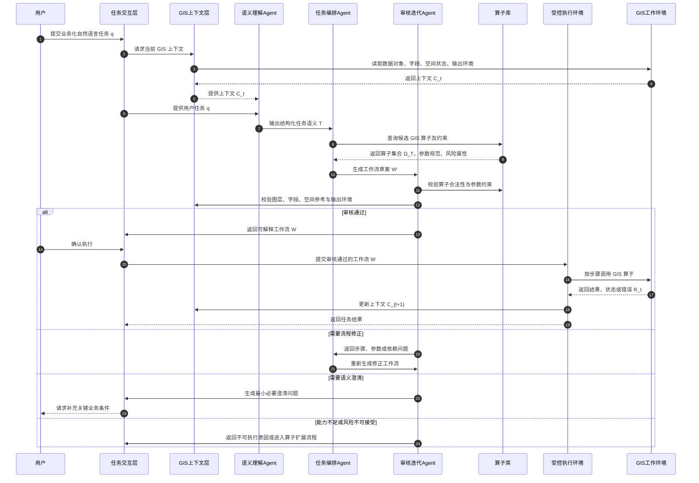

# 研究方法大纲

## 2 研究方法

本文提出一种面向业务化自然语言 GIS 任务的上下文感知多 Agent 协同方法。该方法的目标不是让大语言模型直接替代 GIS 软件执行操作，而是将用户以业务目标形式提出的自然语言需求，转化为可解释、可约束、可审核和可执行的 GIS 工作流。方法重点放在三个问题上：第一，如何在 GIS 上下文中理解用户任务；第二，如何将任务语义组织为受算子库约束的工作流；第三，如何在执行前后通过审核和反馈保证任务正确性与意图一致性。

本节不展开具体 GIS 平台和编程接口。实验部分再说明该方法如何在具体 GIS 软件环境中实现和验证。

## 2.1 方法总体架构

本文方法采用分层式总体架构。其核心思想是将自然语言交互、多 Agent 推理、算子能力约束、工作流审核和 GIS 受控执行划分为不同层次，使每一层承担清晰职责。大语言模型不直接作用于空间数据，而是在智能协同层中完成任务理解、工作流组织和审核修正；真实 GIS 操作被限定在算子库和受控执行层之内。

从层次关系上看，该架构由用户交互层、GIS 上下文层、智能协同层、算子库约束层、工作流审核层、受控执行层和反馈更新层组成。用户交互层负责接收业务化自然语言需求和必要澄清；GIS 上下文层负责提供当前数据环境和任务环境；智能协同层负责完成语义理解与任务编排；算子库约束层限定系统可使用的 GIS 操作能力；工作流审核层在执行前检查正确性和风险；受控执行层调用 GIS 环境完成真实数据处理；反馈更新层将执行状态和结果重新写入上下文。

**图 2-1 方法总体架构**

该架构的关键不在于增加多个 Agent 的数量，而在于用分层方式隔离不同性质的问题。交互层面向用户业务表达，上下文层提供事实基础，智能协同层完成任务推理，算子库约束层限定能力边界，审核层控制正确性和风险，执行层完成真实 GIS 处理，反馈层支撑连续任务。由此，自然语言 GIS 任务不再是“用户输入-模型生成-工具执行”的线性过程，而是一个分层约束下的闭环协同过程。

给定用户自然语言任务 \(q\)、GIS 上下文 \(C\) 和算子库 \(\Omega\)，系统生成工作流 \(W\)：

\[
W = F(q, C, \Omega)
\]

该表达强调，GIS 工作流不是单独由用户文本决定，也不是单独由模型知识决定，而是由用户意图、当前 GIS 环境和系统可用算子能力共同决定。

## 2.2 任务数据流与闭环处理过程

为避免方法停留在静态架构层面，本文进一步将任务处理过程描述为一个数据流闭环。该闭环从用户需求进入系统开始，经过上下文读取、任务语义建模、算子检索、工作流生成、审核修正、受控执行和结果反馈，最终将执行结果重新写入 GIS 上下文，为后续任务提供新的环境状态。

**图 2-2 自然语言 GIS 任务的数据流过程**

该数据流图体现了本文方法与一般工具调用式 GIS Agent 的区别。系统并非在用户输入后立即选择工具执行，而是先把用户表达放入当前 GIS 上下文中解释，再在算子库约束下生成工作流，最后通过审核迭代决定是否执行、修正、澄清或拒绝。执行结果也不是一次性输出，而是重新进入上下文，使系统能够支持连续任务和多轮空间分析。

## 2.3 GIS 上下文感知与任务语义建模

GIS 任务的难点首先不在于调用哪个工具，而在于用户业务表达与真实空间数据环境之间存在语义间隔。同一句自然语言需求，在不同图层、字段、空间参考和当前选择状态下可能对应完全不同的处理对象和操作路径。因此，本文将上下文感知作为语义理解的前置条件，而不是把它作为执行阶段的附属信息。

本文将 GIS 上下文表示为：

\[
C = \{L, A, S, E\}
\]

其中，\(L\) 表示数据对象集合，包括矢量图层、栅格数据、表格数据和已有结果；\(A\) 表示属性结构，包括字段名称、字段类型、字段别名和样例值；\(S\) 表示空间状态，包括几何类型、空间参考、当前视图范围和选择状态；\(E\) 表示任务环境，包括默认输出位置、历史结果和交互状态。

在上下文 \(C\) 的约束下，语义理解 Agent 将用户需求 \(q\) 转化为 GIS 任务语义 \(T\)：

\[
T = \langle G, O, R, M, K, U \rangle
\]

其中，\(G\) 表示任务目标，如查询、筛选、分析、生成、统计或导出；\(O\) 表示任务对象，如目标图层、空间实体或属性表；\(R\) 表示任务约束，包括属性条件、空间关系、范围条件和时间条件；\(M\) 表示候选 GIS 方法类型，如选择、缓冲、叠加、裁剪、聚合或制图输出；\(K\) 表示成果要求，包括输出类型、命名、保存和展示方式；\(U\) 表示待确认信息，即当前上下文无法可靠确定但会影响执行正确性的条件。

该建模过程的重点是把业务语言中的对象、条件、关系和成果要求拆解出来，而不是直接匹配某个 GIS 工具名称。例如，用户表达中的“附近”“范围内”“受影响区域”“导出结果”等词汇，只有结合数据对象、坐标参考和成果要求后，才能转化为可执行的空间关系、距离参数或输出策略。

如果语义理解存在多种不可兼容解释，系统不应直接选择其中一种执行，而应生成最小必要澄清问题。所谓最小必要澄清，是指只询问会阻塞正确执行的关键条件，例如目标图层无法唯一确定、空间距离缺失、输出对象不明确或存在高风险修改行为。该策略可以避免系统把所有不确定性都推给用户，同时防止在关键条件缺失时生成看似完整但实际错误的工作流。

## 2.4 基于算子库约束的工作流编排

本文方法的核心不在于让模型“会调用工具”，而在于让模型能够围绕业务目标组织多个 GIS 算子，并形成可解释、可检查的任务流程。为此，本文将 GIS 能力抽象为算子库 \(\Omega\)，并要求所有工作流步骤都必须来自该算子库。

单个 GIS 算子可表示为：

\[
o_i = \langle I_i, P_i, O_i, pre_i, post_i, r_i \rangle
\]

其中，\(I_i\) 为输入数据，\(P_i\) 为参数集合，\(O_i\) 为输出结果，\(pre_i\) 为前置条件，\(post_i\) 为执行后状态，\(r_i\) 为风险属性。算子库为：

\[
\Omega = \{o_1, o_2, \ldots, o_n\}
\]

在算子库约束下，任务编排 Agent 将任务语义 \(T\) 转化为工作流 \(W\)。工作流可表示为有向图：

\[
W = (V, E)
\]

其中，\(V\) 表示工作流步骤集合，每个节点对应一个已注册 GIS 算子；\(E\) 表示步骤之间的输入输出依赖关系。若第 \(j\) 个步骤需要使用第 \(i\) 个步骤的输出，则存在依赖边 \(e_{ij}\)。

工作流生成可以理解为一个带约束的搜索与组织问题：

\[
W^* = \arg\max_{W \in \mathcal{W}(\Omega)} S(W, T, C)
\]

\[
\text{s.t. } Valid(W, \Omega, C) = 1,\quad Risk(W) \leq \tau
\]

其中，\(\mathcal{W}(\Omega)\) 表示由算子库 \(\Omega\) 可构成的候选工作流空间，\(S(W,T,C)\) 表示工作流与任务语义及上下文的匹配程度，\(Valid(W,\Omega,C)\) 表示工作流在算子、参数、上下文和依赖关系上的合法性，\(Risk(W)\) 表示工作流风险，\(\tau\) 表示可接受风险阈值。

这一形式化表达不意味着系统必须采用固定的数学优化算法，而是用于说明本文方法的基本约束：工作流必须由已知算子构成，必须满足当前 GIS 上下文，必须具有闭合的数据依赖，且风险不能超过可接受范围。

任务编排 Agent 在生成工作流时需要完成三类组织。第一是方法组织，即判断任务目标应由哪些 GIS 方法共同完成，而不是将任务压缩为单一操作。第二是参数组织，即把任务语义中的对象、字段、空间关系、距离、输出名称和成果类型转化为结构化参数。第三是依赖组织，即显式记录每一步输出如何被后续步骤使用，避免中间结果依赖仅存在于模型隐含推理中。

该机制使工作流具备可解释性和可审核性。每一步不仅说明执行什么算子，还说明为什么需要该步骤，以及该步骤的输出如何服务于最终任务目标。相比直接生成脚本或自由文本指令，算子化工作流更容易进行合法性检查、风险控制和跨平台迁移。

## 2.5 审核迭代与意图一致性控制

复杂 GIS 任务的错误往往不是语法错误，而是任务理解、方法选择或结果目标发生偏差。因此，本文将审核迭代作为工作流进入执行前的必要环节。审核迭代 Agent 不只是检查格式是否正确，而是检查工作流是否真正服务于用户原始意图。

审核函数可表示为：

\[
A(W, T, C) \rightarrow \{pass, revise, clarify, reject\}
\]

其中，\(pass\) 表示工作流可以进入执行阶段；\(revise\) 表示工作流存在步骤、参数或依赖问题，需要返回任务编排 Agent 修正；\(clarify\) 表示任务语义缺少关键条件，需要向用户澄清；\(reject\) 表示当前算子能力不足或存在不可接受风险。

审核重点按照重要性分为四层。第一层是意图一致性，即工作流的目标是否对应用户真正想要的业务结果。第二层是方法合理性，即所选 GIS 算子及其组合是否符合空间分析逻辑。第三层是执行可行性，即图层、字段、空间参考、输出环境和步骤依赖是否成立。第四层是风险可控性，即是否涉及原始数据修改、覆盖结果或其他高风险操作。

当审核失败时，系统根据问题来源进入不同反馈路径。语义问题返回语义理解 Agent，流程问题返回任务编排 Agent，缺失条件返回用户澄清，能力不足则进入算子扩展或任务拒绝流程。通过这种反馈分流，系统能够形成“生成-审核-修正-再审核”的闭环，而不是把执行失败简单归因于模型输出错误。

## 2.6 受控执行、反馈更新与方法通用性

通过审核的工作流由受控 GIS 执行环境执行。本文方法遵循模型不直接执行原则：大语言模型只负责生成任务语义、工作流草案和修正建议，不直接操作空间数据；真实数据处理由受控执行环境按照审核后的工作流逐步调用对应 GIS 算子完成。

执行完成后，系统将结果、状态和错误信息写回上下文：

\[
C_{t+1} = C_t \oplus R_t
\]

其中，\(C_t\) 表示第 \(t\) 轮任务前的 GIS 上下文，\(R_t\) 表示执行产生的结果、状态或错误信息，\(C_{t+1}\) 表示更新后的上下文。若执行成功，新生成数据和地图状态可以作为后续任务输入；若执行失败，错误信息进入审核迭代环节，用于判断失败原因是语义理解偏差、流程编排错误、上下文变化还是算子能力不足。

该方法的通用性来自三个抽象层。第一，GIS 上下文抽象不依赖具体软件界面，只要求目标平台能够提供数据对象、属性结构、空间状态和任务环境。第二，算子库抽象不依赖具体 API 名称，只要求平台能够将 GIS 操作注册为具有输入、参数、输出和风险属性的可执行单元。第三，工作流抽象不依赖具体执行器，只要求平台能够按照结构化步骤执行算子并返回状态反馈。因此，该方法可以在不同 GIS 平台中实现，实验部分只需说明本文选取的具体实现环境及验证方式。

## 2.7 小节写作重心

本章不应平均铺开所有模块，而应突出以下主次关系。

| 小节 | 写作权重 | 内容重点 |
|---|---:|---|
| 2.1 方法总体架构 | 高 | 给出完整架构图，说明为什么不是线性工具调用，而是上下文感知的受控多 Agent 闭环 |
| 2.2 任务数据流 | 高 | 用类似时序图的数据流说明一次任务如何从自然语言进入工作流、审核、执行和反馈 |
| 2.3 任务语义建模 | 高 | 解释业务语言如何转化为 GIS 任务语义，这是区别于普通意图识别的关键 |
| 2.4 工作流编排 | 最高 | 重点写算子库约束、工作流图结构、步骤依赖和风险约束，是本文方法主体 |
| 2.5 审核迭代 | 中高 | 强调正确性、方法合理性和意图一致性审核，不只写格式校验 |
| 2.6 受控执行与通用性 | 中 | 简洁收束，说明模型不直接执行，以及为什么方法不局限于某一 GIS 平台 |

## 写作边界

研究方法部分不写具体 GIS 软件名称、具体编程语言、工程结构、接口路径或运行环境。具体系统实现、实验平台、案例任务、对比方法和运行结果放入实验章节。方法部分统一使用“GIS 工作环境”“GIS 上下文”“算子库”“结构化工作流”“多 Agent 协同”“受控执行环境”等抽象术语，以保证论文方法具有思想性和通用性。
